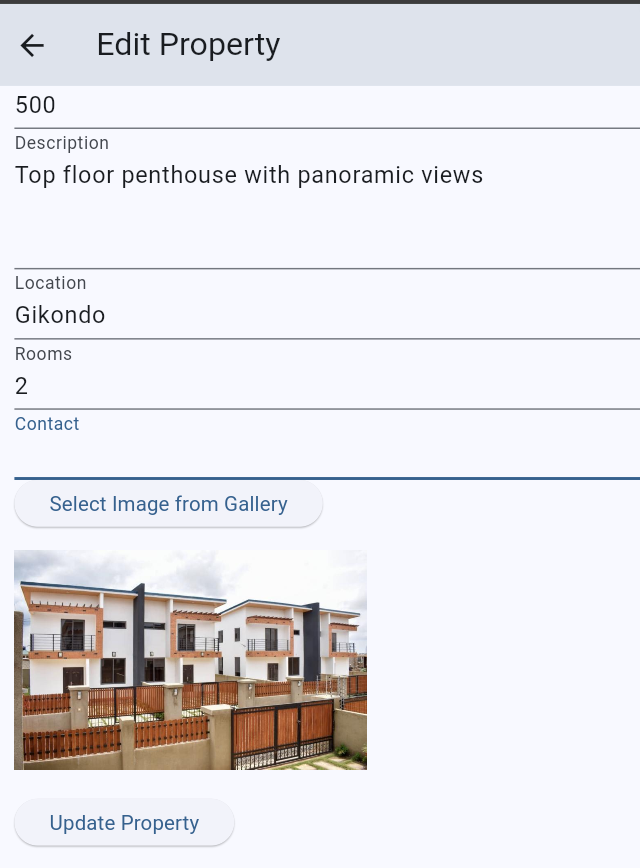

# Property Management App

A Flutter application for managing rental properties, allowing landlords and tenants to interact seamlessly.

## Description

The Renting App is designed to facilitate the management of rental properties. It provides features for landlords to list properties, manage tenants, and for tenants to search for available properties, submit applications, and communicate with landlords.

## Features

- User authentication for landlords and tenants
- Property listing and management
- Search functionality for tenants
- Application submission for rental properties
- Dashboard for landlords to manage their properties

## Installation

To get started with the Renting App, follow these steps:

1. Clone the repository:
   ```bash
   git clone https://github.com/Garrisoncraft/renting.git
   ```
2. Navigate to the project directory:
   ```bash
   cd renting
   ```
3. Install the dependencies:
   ```bash
   flutter pub get
   ```

## Firebase Integration

The Renting App utilizes Firebase for user authentication and data management. To set up Firebase for this project, follow these steps:

1. Create a Firebase project in the [Firebase Console](https://console.firebase.google.com/).
2. Add an Android app to your Firebase project and download the `google-services.json` file.
3. Place the `google-services.json` file in the `android/app` directory of your project.
4. Add the necessary Firebase dependencies to your `pubspec.yaml` file:
   ```yaml
   dependencies:
     firebase_core: ^latest_version
     firebase_auth: ^latest_version
     cloud_firestore: ^latest_version
   ```
5. Run `flutter pub get` to install the new dependencies.

For more detailed instructions, refer to the [Firebase documentation](https://firebase.google.com/docs/flutter/setup).

## Usage

To run the application, use the following command:
```bash
flutter run
```

## Screenshots




And more....

## Contributing

Contributions are welcome! Please open an issue or submit a pull request for any improvements or features.

## License

This project is licensed under the MIT License - see the [LICENSE](LICENSE) file for details.
